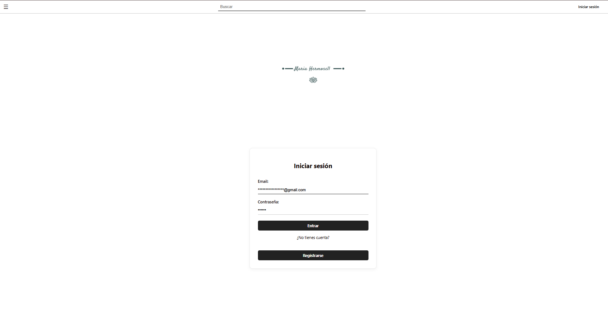
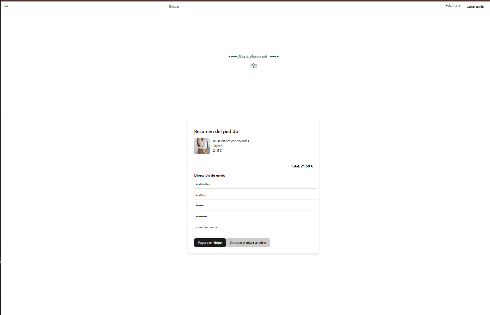
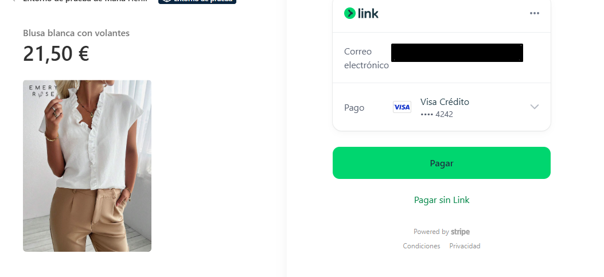

# 🛍️ Ecommerce Fullstack (React + Node.js)

Este proyecto es una **aplicación fullstack de ecommerce** desarrollada como **proyecto de demostración**. Permite a los usuarios navegar productos, registrarse, añadir al carrito, realizar compras con Stripe y ver su historial de pedidos (implementando).

---

## 🔧 Tecnologías Utilizadas

### Frontend (React)
- React + Vite
- Context API y Hooks (useState, useEffect)
- Stripe Checkout (pago de prueba)
- CSS personalizado (responsivo y moderno)

### Backend (Node.js)
- Express
- MongoDB + Mongoose
- JWT para autenticación
- Stripe API (modo test)
- Nodemailer para emails
- Jest + Supertest para testing

---

## 🖼️ Capturas de Pantalla

### 🏪 Vista principal del ecommerce


### 🛒 Resumen de pedido 


### 💳 Pasarela de pago con Stripe



---

## ⚙️ Instalación

### Requisitos Previos
- Node.js v16+
- MongoDB local o remoto
- Cuenta de Stripe (clave de prueba)
- Cuenta Gmail con clave de aplicación

### Backend

```bash
git clone https://github.com/MariaHermosell/Ecommerce.git
cd ecommerce-fullstack/backend-node
npm install
```

Crea un `.env` con:

```env
PORT=5000
MONGO_URI=mongodb://localhost:27017/ecommerce
JWT_SECRET=tu_clave_jwt
EMAIL_USER=tu_email@gmail.com
EMAIL_PASS=clave_de_app
STRIPE_SECRET_KEY=sk_test_xxx
```

```bash
npm start
```

### Frontend

```bash
cd ../frontend-react
npm install
npm run dev
```

Configura `.env` si usas Vite:

```env
VITE_STRIPE_PUBLIC_KEY=pk_test_xxx
```

---

## 🧪 Testing

```bash
cd backend-node
npm test
```

---

## 📚 Endpoints API

### 🔐 Usuarios
- `POST /api/usuarios/registro` — Registro
- `POST /api/usuarios/login` — Login + JWT
- `GET /api/usuarios/perfil` — Perfil

### 🛒 Carrito
- `GET /api/usuarios/carrito` — Obtener carrito
- `PUT /api/usuarios/carrito` — Guardar carrito

### 📦 Productos
- `GET /api/productos` — Listado
- `POST /api/productos` — Crear (admin)
- `PUT /api/productos/:id` — Editar
- `DELETE /api/productos/:id` — Eliminar

### 💳 Pagos (Stripe)
- `POST /api/pago/crear-sesion` — Stripe Checkout Session

### 📬 Contacto
- `POST /api/contacto` — Enviar email

---

## 💳 Credenciales de Prueba (Stripe)

**Clave Pública:** `pk_test_51RSj2S2f...`  
**Clave Secreta:** *(configurar en .env)*

**Tarjeta de prueba:**  
- Número: `4242 4242 4242 4242`
- Fecha: Cualquiera válida
- CVC: `123`

---

## 🧩 Mejoras Planeadas

- Historial de pedidos
- Paginación y filtros
- Panel de administración
- Reseñas de productos

---

## ⚠️ Nota

Este es un **proyecto de demostración** y no debe usarse en producción tal cual. El objetivo es mostrar buenas prácticas en un stack completo.

---

¿Te gusta el proyecto? ⭐ Dale star y ¡me encantaría recibir feedback o sugerencias!
